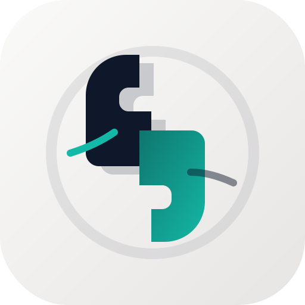

# Language Shadowing

<p align="center">
  
</p>

<p align="center">
  A Windows-focused .NET MAUI app for pronunciation practice through shadowing: generate speech from text, play it back with waveform feedback, and compare live speech recognition against the original transcript.
</p>

<p align="center">
  
  
  
</p>

## Overview

Language Shadowing is a desktop app for practicing spoken language by repeating text in sync with synthesized speech. You provide the source text, choose a system voice, tune playback parameters, and let the app:

- synthesize the text into spoken audio,
- play the generated speech with transport controls,
- render a waveform preview,
- listen to the microphone continuously on Windows,
- score the recognized transcript against the source text in real time.

The current implementation is intentionally scoped as a Windows-first MVP. The codebase already separates speech, playback, recognition, settings, and UI concerns so the app can evolve beyond the built-in Windows provider later.

## Features

- Built-in Windows speech synthesis using installed system voices
- Voice selection with locale and gender metadata
- Adjustable speech rate, pitch, and volume
- Playback controls: play, pause, stop, rewind, and seek
- Waveform visualization generated from synthesized WAV data when available
- Live dictation using Windows speech recognition
- Real-time transcript scoring based on token alignment
- Theme selection: light, dark, or system
- Persistence of user preferences between launches

## How It Works

The core interaction loop is straightforward:

1. Enter or paste the source text.
2. Select a voice and tune the speech profile.
3. Press `Play` to synthesize the text and start playback.
4. Turn on `Dictation` to capture microphone input.
5. Review the recognized transcript and the current shadowing score.

The score is computed by a lightweight analyzer that tokenizes both texts and compares them with a longest common subsequence pass. This makes the result deterministic and fast enough to update on every recognition event.

## UI Layout

The main screen is organized into four functional areas:

- `Speech setup`: engine, voice, speed, pitch, volume, dictation, and theme
- `Source text`: editable text that drives synthesis and scoring
- `Playback`: waveform, status text, progress slider, and transport controls
- `Recognized transcript`: live transcript with a score badge and summary

## Architecture

The solution is split into four projects:

| Project | Responsibility |
| --- | --- |
| `LanguageShadowing.Core` | Domain contracts, capability flags, playback and recognition models, synthesis DTOs |
| `LanguageShadowing.Application` | MVVM support, settings abstractions, transcript analysis, and the main session coordinator |
| `LanguageShadowing.Infrastructure` | Windows speech synthesis, playback, recognition, voice catalog, waveform generation, and settings persistence |
| `LanguageShadowing.App` | .NET MAUI UI, XAML views, styling, and the custom waveform control |

The UI does not talk directly to platform APIs. Instead, it depends on speech abstractions such as `ISpeechEngine`, `ITextToSpeechService`, `IAudioPlaybackController`, `ISpeechRecognitionService`, and `IVoiceCatalogService`.

This keeps the platform-specific code isolated and makes the app easier to test, maintain, and extend.

Additional notes are available in [docs/Architecture.md](docs/Architecture.md).

## Windows Implementation Details

On Windows, the app uses Microsoft platform APIs:

- `Windows.Media.SpeechSynthesis.SpeechSynthesizer` for TTS and voice enumeration
- `Windows.Media.Playback.MediaPlayer` for audio playback
- `Windows.Media.SpeechRecognition.SpeechRecognizer` for continuous speech recognition

When WAV analysis is possible, the waveform is derived from the generated audio payload. If that analysis is not available, the app falls back to an estimated waveform so playback still has a visual guide.

## Persisted Settings

The app stores only lightweight user preferences:

- selected voice
- speech rate
- speech pitch
- speech volume
- dictation enabled/disabled
- theme preference

The source text is intentionally not persisted.

## Requirements

- Windows 10 version `19041` or newer, or Windows 11
- .NET 9 SDK
- .NET MAUI Windows workload

Recommended setup:

- Visual Studio 2022 with .NET MAUI support

## Getting Started

Clone the repository and restore/build the solution:

```powershell
git clone <your-fork-or-repo-url>
cd LanguageShadowing
dotnet workload install maui-windows
dotnet restore
dotnet build src/LanguageShadowing.App/LanguageShadowing.App.csproj -f net9.0-windows10.0.19041.0
```

Run the app:

```powershell
dotnet run --project src/LanguageShadowing.App/LanguageShadowing.App.csproj -f net9.0-windows10.0.19041.0
```

If you prefer Visual Studio, open `LanguageShadowing.sln`, set `LanguageShadowing.App` as the startup project, and run the Windows target.

## Usage Notes

- Dictation depends on microphone permission and Windows speech/privacy settings.
- Installed system voices determine what appears in the voice picker.
- Recognition quality depends on the microphone, environment, and Windows speech services.
- The score is a lexical similarity heuristic, not a phonetic pronunciation model.

## Current Limitations

- The app project currently targets Windows only.
- Non-Windows speech services exist as fallback structure, not as full-featured first-class targets.
- Shadowing assessment compares text tokens, not pronunciation acoustics.
- There are no automated tests in the repository yet.

## Repository Layout

```text
.
+-- docs/
|   +-- Architecture.md
+-- src/
|   +-- LanguageShadowing.App/
|   +-- LanguageShadowing.Application/
|   +-- LanguageShadowing.Core/
|   +-- LanguageShadowing.Infrastructure/
|   +-- logo/
+-- LanguageShadowing.sln
```

## License

The source files in this repository are authored under the MIT License header.
